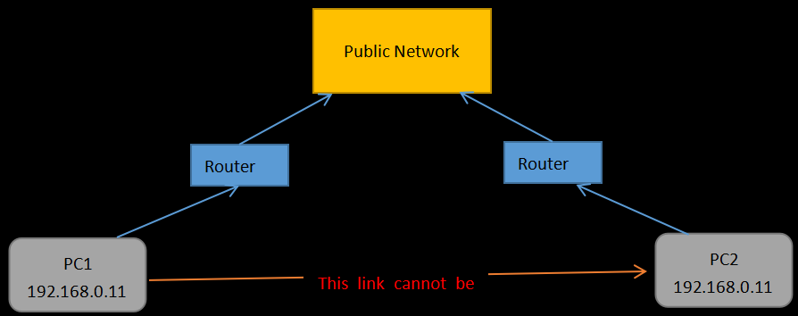
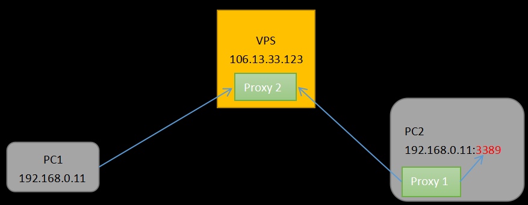

# A remote desktop proxy
```
This is a remote desktop proxy written in go, you can deploy it, and then access your computer remotely anywhere; the code is only 500 lines;

Its cost is very low, take Baidu cloud as an example, 10 yuan a month, 3 people share, each person only needs 3 yuan;
```

# Design
* As shown in the figure below, PC1 and PC2 are respectively under the router of LAN, and there is no public IP, so PC1 cannot access PC2;

* A public VPS is needed as an proxy to connect PC1 and PC2, as shown in the following figure;

```
Proxy 1 runs in PC2, connects port 3389 of PC2, forwards the data to the VPS, and transfers the data between proxy 2 and port 3389 of the local machine;

Proxy 2 runs on the VPS, accepts the remote desktop connection request of PC1, accepts the request of proxy 1 on PC2, and transfers the data between them;
```

# How to use
## 1. Rent a VPS with a public IP address;
## 2. Compile
```
It's easy to compile for go;
```
## 3. Run
* Note: let's assume that "106.13.33.123" is the public network IP of the VPS, and "172.16.33.123" is the local network IP of the VPS; The compiled program name is main(Linux), main.exe(Windows)
```
Run on VPS:
nohup ./main -log_dir="./log" -v=10 -alsologtostderr=true -st="ss" -s1="172.16.33.123:3390" -s2="172.16.33.123:52201" &
Run on PC2:
start .\main.exe -log_dir="./log" -v=10 -alsologtostderr=true -st="cc" -s1="127.0.0.1:3389" -s2="106.13.33.123:52201"
```
* Note: 
```
The proxy 2 on the VPS opens ports 52201 and 3390 of the local machine. Port 52201 is for proxy 1 connection, and port 3390 is for PC1 connection;
```
```
The proxy 1 on PC2 is connected to port 52201 of the VPS and port 3389 of the local machine;
```
## 4 OK, You can connect to your computer remotely anywhere, for example;
* Connect to 106.13.33.123:3390 with remote desktop, on PC1;
* Using Microsoft's remote desktop app to connect 106.13.33.123:3390 on mobile phones
* Connect 106.13.33.123:3390 with Microsoft's remote desktop app on iPad

